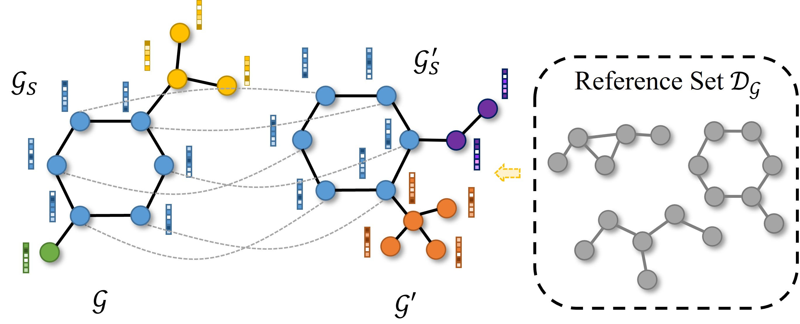

# MatchExplainer for Explaining Graph Neural Networks 
This is the code for our ICML 2023 paper **Rethinking Explaining Graph Neural Networks via Non-parametric Subgraph Matching** 
[[arXiv](https://arxiv.org/abs/2301.02780)].
we propose a novel non-parametric subgraph matching framework, dubbed MatchExplainer, to explore explanatory subgraphs. 
It couples the target graph with other counterpart instances and identifies the most crucial joint substructure by minimizing the node corresponding-based distance. 

<p align="center"></p>

## Environment 
We rely on [DIG](https://github.com/divelab/DIG) to run the experiments. Before that, you need to install
[Pytorch](https://pytorch.org/get-started/locally/) and [torch_geometric](https://pytorch-geometric.readthedocs.io/en/latest/notes/installation.html#) first. Please note that torch_geometric requires Pytorch >= 1.10
```markdown
# CUDA 10.2
conda install pytorch==1.6.0 torchvision==0.7.0 cudatoolkit=10.2 -c pytorch
# CUDA=cu102  TORCH=1.7.1
pip install torch-scatter -f https://pytorch-geometric.com/whl/torch-${TORCH}+${CUDA}.html 
pip install torch-sparse -f https://pytorch-geometric.com/whl/torch-${TORCH}+${CUDA}.html
pip install torch-cluster -f https://pytorch-geometric.com/whl/torch-${TORCH}+${CUDA}.html
pip install torch-spline-conv -f https://pytorch-geometric.com/whl/torch-${TORCH}+${CUDA}.html
pip install torch-geometric==1.7.0

# the latest version e.g., 0.1.18 does not support ConstraintBasedEstimator
pip install pgmpy==0.1.10
```  


## Running MatchExplainer 
### Data
Four datasets have been utilized in our experiments. The processed raw data for **BA-3Motif** is available at 
[ReFine-BA3](https://github.com/Wuyxin/ReFine/tree/main/data/BA3/raw). The other two datasets **MNIST** and **Mutagenicity** 
will be automatically downloaded when training models. The last dataset **VG-5** is generated by ReFine [[1]](#1) and can be downloaded 
from [Google Drive](https://drive.google.com/file/d/1zFHyLTZm0N0Ckylx5aqfG-jRdlywBPXP/view?usp=sharing). Please make sure that the dictionary is 
arranged as follows and cite the Visual Genome [[2]](#2) if using VG-5. 
```
data ---BA3
 |------VG
        |---raw
```
### Pretraining GNNs 
Before explaining GNNs, it is necessary to first train them. We have already provided trained GNNs in `param/gnns` for those four different tasks. 
However, you can also retrain the model by calling:
```markdown
cd gnns/
python ba3motif_gnn.py   # change the name of script for different datasets
```

### Explaining GNNs 
In order to call the MatchExplainer, you can directly run the following command. Notably, unlike PGExplainer [[3]](#3) or ReFine [[1]](#1), 
MatchExplainer requires no additional training. You can set `--dataset` to `['vg', 'ba3', 'mutag', 'mnist']` to
evaluate on different tasks. You can also define different subgraph size by controlling the `--ratio` argument. 
```markdown
python main.py --dataset=xxx
```
After that, you can also run `visual.py` to envision the results produced by MatchExplainer. 

### Frequently Occurred Rrror
When implementing the code, you may encounter the following error as `OSError: libcusparse.so.11: Cannot open shared object file`.
Here we offer a potential solution to debug. 
#### Install locate on Ubuntu and Debian
```markdown
sudo apt update
sudo apt install mlocate
```

#### Find the libcusparse.so.11
```markdown
locate libcusparse.so.11
export PATH=/opt/conda/lib:$PATH
export LD_LIBRARY_PATH=/opt/conda/pkgs/cudatoolkit-11.1.1-h6406543_8/lib:$LD_LIBRARY_PATH

# for jupyter notebook
%env PATH=/opt/conda/lib:$PATH
%env LD_LIBRARY_PATH=/opt/conda/pkgs/cudatoolkit-11.1.1-h6406543_8/lib:$LD_LIBRARY_PATH
```
Reference: [A](https://github.com/pyg-team/pytorch_geometric/issues/2040),
[B](https://blog.csdn.net/little_cute/article/details/124766123?spm=1001.2101.3001.6650.3&utm_medium=distribute.pc_relevant.none-task-blog-2%7Edefault%7ECTRLIST%7Edefault-3-124766123-blog-121440577.pc_relevant_default&depth_1-utm_source=distribute.pc_relevant.none-task-blog-2%7Edefault%7ECTRLIST%7Edefault-3-124766123-blog-121440577.pc_relevant_default&utm_relevant_index=6 
)

Except `OSError`, you might find `undefined symbol` (e.g., _ZN2at6detail20DynamicCUDAInterface10set_deviceE). 
Just clear the pip cache and reinstall the respective package. You can refer to [Frequently Asked Questions](https://pytorch-geometric.readthedocs.io/en/latest/notes/installation.html) for more helps. 


<h2 id="How-to-cite">How to cite and acknowledgements</h2>
If you find our helpful and interesting, please consider citing our paper. Thank you! 😜 
Any kind of question is welcome, and you can directly pull an issue or email [Fang WU](mailto:fw2359@columbia.edu). 
This work is highly supported by [MindRank AI](), a start-up AI drug discovery company in Hangzhou, and was done when Fang Wu was an intern there. 
We build our code based on [ReFine](https://github.com/Wuyxin/ReFine) and would like to thank Yuxin Wu for her open-source spirit. 
```markdown
@article{wu2023explaining,
  title={Explaining Graph Neural Networks via Non-parametric Subgraph Matching},
  author={Wu, Fang and Li, Siyuan and Wu, Lirong and Radev, Dragomir and Jiang, Yinghui and Jin, Xurui and Niu, Zhangming and Li, Stan Z},
  journal={arXiv preprint arXiv:2301.02780},
  year={2023}
}
```
<h2 id="References">References</h2>
<a id="1">[1]</a> 
Wang, Xiang, et al. "Towards multi-grained explainability for graph neural networks." Advances in Neural Information Processing Systems 34 (2021): 18446-18458.   

<a id="2">[2]</a> 
Krishna, Ranjay, et al. "Visual genome: Connecting language and vision using crowdsourced dense image annotations." International journal of computer vision 123 (2017): 32-73.   
  
<a id="3">[3]</a> 
Luo, Dongsheng, et al. "Parameterized explainer for graph neural network." Advances in neural information processing systems 33 (2020): 19620-19631.  

